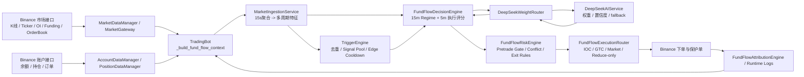

# FUND_FLOW交易策略技术评审说明

## 摘要

本文面向专家组评审，系统化说明当前工程中 `FUND_FLOW` 实盘交易系统的设计目标、运行架构、信号逻辑、风险控制、执行机制与改进建议。本文讨论的对象不是某个单独指标或某段回测公式，而是当前项目中已经工程化落地的完整交易闭环。核心代码位于 `src/app/fund_flow_bot.py`、`src/fund_flow/decision_engine.py`、`src/fund_flow/market_ingestion.py`、`src/fund_flow/deepseek_weight_router.py`、`src/fund_flow/ai_weight_service.py`、`src/fund_flow/trigger_engine.py`、`src/fund_flow/risk_engine.py`、`src/fund_flow/execution_router.py`，主配置位于 `config/trading_config_fund_flow.json`。

从系统定位上看，FUND_FLOW 不是单纯的趋势跟踪策略，也不是传统意义上的纯技术指标策略，而是一套以“资金流代理特征”为核心、以多周期状态识别为框架、以技术共振为过滤层、以 AI 权重微调为增强器、以风控和执行鲁棒性为底座的混合式永续合约交易系统。它的目标不是在每一根 K 线上都给出交易动作，而是在市场存在相对清晰的资金驱动、一致性结构、可接受的微结构风险和明确的技术配合时，选择性地进入，并在持仓后通过更细粒度的复核机制主动压缩风险。

当前版本的实盘导向特征非常鲜明。系统将开仓决策与持仓复核拆分为双节奏调度：空仓时按 `15m` 收线做候选扫描和 AI 终审，持仓时按 `5m` 收线只对已有仓位做 AI 复核和退出管理。当前杠杆统一控制在 `2x`，最大活跃持仓数为 `2`，默认目标仓位约为账户权益的 `10%`，单标的上限为 `15%`。这些设置表明该系统在设计上优先考虑的是稳定性、执行一致性和风控可控，而非追求高频和高杠杆带来的短期收益弹性。

从交易思想上讲，FUND_FLOW 当前主要依赖四类证据共同决定交易动作。第一类是资金流代理特征，包括 `cvd_ratio`、`cvd_momentum`、`oi_delta_ratio`、`funding_rate`、`depth_ratio`、`imbalance`、`liquidity_delta_norm` 等。第二类是微结构证据，包括 `spread_z`、`phantom_score`、`trap_score`、`micro_delta` 等，用于识别交易环境是否存在“看起来有信号，但实际盘口质量很差”的情形。第三类是趋势与方向校验，包括 `15m ADX/ATR/EMA` 形成的 regime 识别，以及 `1h MA10 + 5m MACD/KDJ` 形成的方向共振过滤。第四类是 AI 权重路由，它不直接决定方向、仓位、阈值和执行，只负责根据当前上下文动态调整各资金流因子的相对权重和置信度。

系统设计上最值得肯定的地方，在于它已经具备完整的工程闭环。行情采集与标准化聚合独立成层，触发与信号池独立成层，决策与 AI 权重调节独立成层，前置风控与账户风控独立成层，执行与保护单修复独立成层。这种分层意味着系统在实盘中出现问题时，能够较为清晰地定位是“数据问题、信号问题、风控问题还是执行问题”，而不是所有逻辑耦合在一个大函数中无法拆解。

同时，当前版本已经明显体现出“失败可降级”的实盘思路。若 AI 不可用，则回退到本地默认权重；若持仓保护单挂载失败，则进入 SLA 修复与应急平仓逻辑；若 IOC 不能成交，则逐步退化到 GTC 或 Market；若启动时历史不足，则通过市场预载机制预先下载近 `60-120` 分钟的 `5m` K 线和 OI history，尽量修复 `hist15_insufficient`、`oi_delta`、`adx` 等 AI 依赖字段。这说明系统已经从“策略原型”进入“交易基础设施”的范畴。

总体而言，FUND_FLOW 的核心价值不在于某个因子的绝对收益贡献，而在于它通过多周期状态识别、资金流一致性约束、信号池门控、AI 权重限权、前置风控 Gate、保护单 SLA 和降级执行路径，建立了一套相对稳健的实盘交易操作系统。本文以下各节将分别从架构、信号、风控、执行和评审角度展开说明。

### 评审结论摘要

- 从工程成熟度看，当前版本已经不是单一策略脚本，而是具备冷启动预热、结构化决策、风控串联、执行降级和异常兜底能力的可运行实盘系统。
- 从策略定位看，系统明显偏保守：`2x` 固定杠杆、最大 `2` 个同时持仓、空仓 `15m` 审核、持仓 `5m` 复核，目标是提高一致性与可解释性，而不是追求高频交易。
- 从方法论看，系统使用“资金流代理 + 多周期 regime + 技术共振 + AI 调权”的复合结构，其中 AI 被严格限权，不直接拥有方向、仓位或执行权限，整体架构符合审慎实盘原则。
- 从现阶段边界看，代理 CVD 与代理 OI 仍然不等于真实逐笔订单流，区间反转模型在趋势切换区仍需继续验证；因此系统当前更适合被视为“可控实盘框架”，而非“已充分证明上限的成熟 alpha 引擎”。
- 从评审结论看，建议继续投入，但投入重点应放在数据真实性、执行质量统计、AI 贡献归因和 regime 切换稳定性验证，而不是单纯扩大交易频次或提高杠杆。

## 架构

### 1. 总体分层结构

当前 FUND_FLOW 系统可以概括为五层。

第一层是数据采集层。该层通过 Binance 客户端获取市场 K 线、24 小时行情、资金费率、持仓量、订单簿深度、账户余额、持仓风险与开放订单。市场数据主要通过 `MarketDataManager` 与 `MarketGateway` 读取，账户和持仓则由 `AccountDataManager`、`PositionDataManager` 和交易客户端负责。该层只负责“拿到事实”，不直接形成交易结论。

第二层是聚合与特征层。实时数据进入 `TradingBot._build_fund_flow_context()` 之后，被转换成标准化的资金流输入，再交给 `MarketIngestionService.aggregate_from_metrics()`。该服务以 `15s` 为基础桶，向上滚动聚合为 `1m/3m/5m/15m/30m/1h/2h/4h` 多个周期，并输出 `timeframes`、`microstructure_features` 与 `fund_flow_features`。这一层将离散原始行情转成统一语义结构，是后续所有决策逻辑的共同输入基座。

第三层是信号与决策层。这里最核心的组件是 `FundFlowDecisionEngine`。它首先在 `15m` 识别市场状态，即 `TREND`、`RANGE` 或 `NO_TRADE`，然后在 `5m` 执行层计算 long/short 分数，并进行 15m 与 5m 分数融合。该层还负责将 `MACD/KDJ/BB/MA10` 等技术信息纳入方向校验，并在需要时通过 `DeepSeekWeightRouter` 和 `DeepSeekAIService` 调用 AI 进行权重动态调节。

第四层是风控层。风控不是一个单点模块，而是由多个子系统组成。包括账户级熔断、前置风险 Gate、方向冲突保护、持仓保护单 SLA、极端波动冷却、DCA 限制、反转确认平仓和新仓保护缓冲等。这些风控逻辑一部分在 `FundFlowDecisionEngine` 内部完成，一部分在 `TradingBot` 运行时逻辑中完成，另一部分则由 `FundFlowRiskEngine` 和执行器共同落实。

第五层是执行层。执行器 `FundFlowExecutionRouter` 负责把高层决策转化为真实订单。它支持开仓 IOC 首发、逐步提价重试、GTC 回退、Market 回退、保护单下发、reduce-only 平仓、一致性重查、数量归零兜底和失败降级路径记录。执行器同时配合 `FundFlowAttributionEngine` 完成执行归因与日志沉淀。

### 2. 启动流程与调度机制

系统的运行入口在 `TradingBot`。启动时会完成日志系统初始化、Binance 客户端初始化、配置加载、风险状态恢复、资金流模块初始化以及市场历史预热。当前版本在 `__init__` 阶段增加了启动预载逻辑：在首轮决策前，系统会按配置预加载近 `120` 分钟的 `5m` K 线和 `5m` OI history，并将这些数据通过统一聚合接口灌入内存历史。这一机制的作用非常明确，即在系统冷启动时尽量消除 AI 上下文中的历史不足问题，为第一轮决策准备足够的 `15m history`、`oi_delta` 基线和趋势过滤缓存。

调度方面，系统目前采用“空仓 15m、持仓 5m”的双节奏结构。空仓时，调度器只在 `15m` 开仓窗口触发候选扫描与 AI 终审；持仓时，调度器只在 `5m` 窗口对已有仓位做 AI 复核、保护检查和退出管理。这样的好处在于，系统把算力和注意力优先分配给当前暴露风险的持仓，而不是在持仓期间继续高频扫描新机会。对于实盘交易系统，这种资源配置方式通常比“无差别全市场扫描”更稳健。

### 3. 数据对象与标准输出

系统内部围绕 `MarketFlowSnapshot` 和 `FundFlowDecision` 两个结构组织上下游协作。前者是聚合后的市场快照，包含资金流指标、多周期聚合结果、微结构特征与标准化 fund flow 特征；后者是决策引擎的输出，包含 `operation`、`symbol`、`target_portion_of_balance`、`leverage`、`max_price/min_price`、`TP/SL`、`time_in_force` 和 `metadata`。这种结构化输出极大提高了模块间解耦程度。决策引擎不直接下单，执行器也不自己推导信号，两者之间通过明确的意图对象交互。

### 4. AI 在架构中的位置

AI 并不位于架构中心，而是位于决策层旁路。当前 `DeepSeekWeightRouter` 是一个权重路由器，而不是交易决策器。它的职责是根据 regime、z-score、微结构风险和数据质量，对本地资金流因子的权重进行动态重分配，并输出一个 `WeightMap`。真正的方向、阈值、仓位和执行依然由本地脚本控制。这样的设计显著降低了实盘系统被大模型不确定性直接驱动的风险，也使 AI 模块天然具备“可关闭、可降级、不越权”的属性。

### 5. 模块关系图

该图反映的是当前系统的实际控制链路：数据层并不直接驱动下单，而是先经过统一聚合、信号门控、决策融合、风险审查，再由执行器选择最合适的成交路径。AI 只介入决策层中的权重调节环节，不绕过 Trigger、Risk 或 Execution。

### 6. 关键参数表

#### 6.1 账户与调度参数

| 参数 | 当前值 | 含义 | 评审解读 |
| --- | --- | --- | --- |
| `min/default/max_leverage` | `2 / 2 / 2` | 全局杠杆上下限 | 固定低杠杆，强调稳健性 |
| `default_target_portion` | `0.10` | 默认目标仓位占权益比例 | 单笔风险中低，适合保守试运行 |
| `max_symbol_position_portion` | `0.15` | 单标的仓位上限 | 限制单币暴露，降低集中风险 |
| `min_open_portion` | `0.06` | 最小开仓占比 | 防止极小仓位造成手续费/最小名义失真 |
| `max_active_symbols` | `2` | 最大同时持仓数 | 显著抑制过度分散和并发风险 |
| `decision_timeframe` | `15m` | 空仓开仓主决策周期 | 偏保守，降低噪音入场 |
| `ai_review.position_timeframe` | `5m` | 持仓复核周期 | 将持仓管理细粒度化 |
| `ai_review.flat_timeframe` | `15m` | 空仓候选复核周期 | 与主决策周期一致 |
| `ai_review.flat_top_n` | `2` | 空仓进入 AI 终审的候选数 | 降低 AI 成本并聚焦高分标的 |
| `align_to_kline_close` | `true` | 调度对齐收线 | 减少未收线噪音干扰 |
| `preload_market_lookback_minutes` | `120` | 启动预载时长 | 解决冷启动历史不足与 AI 缺字段问题 |

#### 6.2 信号与状态识别参数

| 参数 | 当前值 | 含义 | 评审解读 |
| --- | --- | --- | --- |
| `regime.timeframe` | `15m` | Regime 判定周期 | 用中周期定义市场状态，减少过拟合 |
| `adx_trend_on` | `21` | 趋势开启阈值 | 趋势认定偏严格 |
| `adx_range_on` | `18` | 区间识别阈值 | 为趋势与区间留出灰区 |
| `adx_no_trade_low/high` | `16 / 19` | 不交易区间边界 | 明确允许系统“没有观点” |
| `atr_pct_min/max` | `0.001 / 0.02` | 最低/最高波动容忍度 | 排除死水与极端行情 |
| `direction_lock_mode` | `soft` | 方向锁模式 | 允许有限柔性，但仍强调顺势 |
| `long_open_threshold` | `0.38` | 趋势多头开仓阈值 | 偏保守，要求一定一致性 |
| `short_open_threshold` | `0.30` | 趋势空头开仓阈值 | 略低于多头阈值，体现当前配置偏向审慎做空 |
| `close_threshold` | `0.30` | 趋势平仓阈值 | 持仓退出不追求极晚确认 |
| `score_15m_weight` | `0.4` | 15m 分数融合权重 | 15m 定背景，5m 定执行 |
| `ma10_macd_confluence.tf_exec` | `5m` | 执行层技术过滤周期 | 与持仓复核节奏一致 |
| `ma10_macd_confluence.tf_anchor` | `1h` | 锚定趋势周期 | 为 5m 执行提供更高层方向背景 |
| `entry_hard_filter` | `true` | 是否启用硬过滤 | 技术面可直接否掉不合格入场 |
| `entry_require_macd_trigger` | `true` | 是否要求 MACD 触发 | 避免只凭资金流背景提前入场 |
| `range_quantile.lookback_minutes` | `90` | 区间极值回看窗口 | 适中，兼顾响应与稳定 |
| `range_quantile.min_samples` | `4` | 区间模型最小样本 | 兼容冷启动，但统计稳定性有限 |
| `trend_pool.min_long/short_score` | `0.12 / 0.12` | 普通趋势池最低分 | 明显抑制重复弱触发 |
| `trend_pool_major.min_long/short_score` | `0.18 / 0.18` | 大币趋势池最低分 | 进一步压缩弱信号重入 |
| `range_pool.min_long/short_score` | `0.30 / 0.30` | 区间池最低分 | 对逆势信号要求更高 |

#### 6.3 风控与执行参数

| 参数 | 当前值 | 含义 | 评审解读 |
| --- | --- | --- | --- |
| `max_daily_loss_percent` | `5` | 单日亏损熔断 | 账户级强保护 |
| `max_consecutive_losses` | `2` | 连续亏损熔断 | 限制失配期自我放大 |
| `daily_loss_cooldown_seconds` | `28800` | 单日熔断冷却 | 8 小时，保守 |
| `consecutive_loss_cooldown_seconds` | `1800` | 连续亏损冷却 | 30 分钟，适合短期降温 |
| `stop_loss_pct` | `0.02` | 默认止损比例 | 与低杠杆结构相匹配 |
| `pretrade_risk_gate.entry_threshold` | `0.25` | 前置风险准入阈值 | 强化开仓前再过滤 |
| `pretrade_risk_gate.max_drawdown` | `0.02` | 允许最大回撤 | 控制入场后容忍度 |
| `pretrade_risk_gate.volatility_cap` | `0.012` | 波动上限 | 防止过热环境继续追单 |
| `pretrade_risk_gate.exit_confirm_bars` | `3` | 风险退出确认 bars | 抑制单根噪音平仓 |
| `pretrade_risk_gate.exit_min_hold_seconds` | `300` | 最短持有时间 | 降低秒开秒平概率 |
| `protection_sla_enabled` | `true` | 保护单 SLA | 将保护完整性视为硬约束 |
| `protection_sla_seconds` | `45` | 保护单补齐时限 | 执行后快速检查 |
| `protection_sla_force_flatten` | `true` | SLA 超时是否强平 | 风险偏保守 |
| `protection_immediate_close_on_repair_fail` | `true` | 修复失败是否立即关闭 | 防止裸仓持续暴露 |
| `open_ioc_retry_times` | `3` | 开仓 IOC 重试次数 | 优先控滑点，再考虑退化 |
| `open_ioc_retry_step_bps` | `15` | 开仓逐步提价步长 | 控制开仓攻击性 |
| `open_gtc_fallback_enabled` | `true` | 是否允许 GTC 回退 | 提高成交率 |
| `open_market_fallback_enabled` | `false` | 是否允许开仓回退市价 | 对开仓滑点保持克制 |
| `close_ioc_retry_times` | `1` | 平仓 IOC 重试次数 | 快速退出优先 |
| `close_ioc_retry_step_bps` | `5` | 平仓逐步让价步长 | 兼顾成交与滑点 |
| `close_gtc_fallback_enabled` | `false` | 是否允许平仓回退 GTC | 避免退出拖延 |
| `close_market_fallback_enabled` | `true` | 是否允许平仓回退市价 | 保证最终退出能力 |
| `trigger_dedupe_seconds` | `30` | 触发去重窗口 | 防止短时重复触发 |
| `edge_cooldown_seconds` | `900 / 600` | 趋势/区间边沿冷却 | 显著抑制重复开仓 |

## 信号

### 1. 原始市场信号来源

FUND_FLOW 的底层信号来自三个方面。

第一，价格与 K 线结构。系统使用 24h ticker、15m K 线、5m K 线以及更高周期的历史 K 线，形成 `change_15m`、`change_24h`、`ret_period`、EMA、ADX、ATR、MACD、KDJ、布林带等指标。这部分为系统提供趋势背景、波动尺度与技术状态。

第二，持仓量与资金费率。通过 `openInterest` 和 `fundingRate`，系统试图估计市场中的杠杆方向与成本结构。虽然当前 OI 仍是代理级信息，但在结合价格变化后，它可以用来区分“价格推动中的增仓”和“价格推动中的减仓”。

第三，订单簿微结构。系统基于前 20 档深度构建 `depth_ratio`、`imbalance`、`mid_price`、`microprice`、`spread_bps`、`micro_delta_norm`、`ob_delta_notional` 和 `ob_total_notional`。微结构的作用不在于单独开仓，而在于判断当前交易环境是否存在高滑点、假突破、挂单诱导和流动性陷阱。

### 2. 资金流代理特征

当前系统中的“资金流”并不是交易所逐笔成交级别的真实订单流，而是通过价格、盘口、持仓量和资金费率构造的代理特征体系。核心字段包括：

- `cvd_ratio`：当前实现中主要以短周期价格变化代理资金净驱动方向。
- `cvd_momentum`：CVD 变化的加速度，用于区分“已有方向”与“方向正在强化”。
- `oi_delta_ratio`：当前持仓量相对前值的变化比例。
- `funding_rate`：资金费率，用于刻画杠杆拥挤方向和持仓成本。
- `depth_ratio`：买卖盘深度的相对关系。
- `imbalance`：盘口不平衡程度。
- `liquidity_delta_norm`：订单簿名义资金偏移经过 EMA 和裁剪后的归一化值。

这些字段在 `MarketIngestionService` 中进一步被规范为 `fund_flow_features`。其中最关键的是 OI 方向分离逻辑。系统不把 `oi_delta` 直接等价于看多或看空，而是结合 `ret_period` 判断 OI 增减与价格方向的对应关系。如果价格上涨且 OI 增加，倾向理解为多头增仓；如果价格下跌且 OI 增加，则倾向理解为空头增仓。这种设计明显优于“简单把 OI 增加视为趋势增强”的粗糙做法。

### 3. 微结构信号与陷阱识别

在多数量化系统中，盘口信号常常只是 `imbalance` 一个值，而 FUND_FLOW 当前额外引入了 `spread_z`、`phantom_score` 和 `trap_score`。这三个信号的意义分别是：

- `spread_z`：衡量当前价差是否显著高于近期正常水平。高 `spread_z` 往往意味着流动性恶化，交易成本和滑点风险上升。
- `phantom_score`：用于描述盘口中可能存在的幽灵挂单或虚假深度。
- `trap_score`：用于描述当前市场是否存在容易诱导追单的陷阱结构。

在区间模式中，这些微结构信号尤其重要。因为区间反转最怕遇到“看起来到了极值，但实际上是趋势加速前的假拐点”。因此，系统不仅要求极值出现，还要求 trap/phantom 风险不恶化，或者出现微结构衰减、转折确认。对专家评审而言，这体现了系统已经在尝试从“指标极值触发”走向“极值 + 结构质量”共同决定。

### 4. 15m Regime 识别

FUND_FLOW 将市场状态划分为 `TREND`、`RANGE` 和 `NO_TRADE`。这一识别主要基于 `15m` 周期的 ADX、ATR%、EMA 快慢线和方向锁逻辑。当前配置中：

- `adx_trend_on = 21`
- `adx_range_on = 18`
- `adx_no_trade_low = 16`
- `adx_no_trade_high = 19`
- `atr_pct_min = 0.001`
- `atr_pct_max = 0.02`

这种参数设计意味着，系统不会把低波动、低方向性的环境强行归入趋势交易，也不会在明显极端波动环境中继续机械做信号。`NO_TRADE` 的引入非常关键，因为它为系统提供了一个“明确不做”的状态，而不是在任何市场环境里都逼迫策略给出方向判断。对实盘来说，这通常比“永远有观点”更值钱。

### 5. 5m 执行层与 15m+5m 融合

在 15m 判定 regime 之后，系统会在 5m 层计算执行分数。15m 分数更多代表背景结构和大级别方向可信度，5m 分数更多代表当前是否适合执行。两者在 `FundFlowDecisionEngine` 中进行融合，当前配置中 `15m` 权重约 `0.4`，`5m` 权重约 `0.6`。这种分工说明系统认为开仓与退出必须既符合上位结构，又尊重短周期的实际触发环境。

### 6. MA10 + MACD + KDJ 共振

当前版本已经明显引入技术面共振层，但技术面并不凌驾于资金流之上。1h 的 MA10 偏向用于 anchor，5m 的 MACD 交叉与零轴区间用于执行过滤，KDJ 则作为买卖点时机辅助。配置中启用了：

- `tf_exec = 5m`
- `tf_anchor = 1h`
- `entry_hard_filter = true`
- `entry_require_macd_trigger = true`

其核心思想是：资金流证据必须经过技术共振过滤，避免在技术结构尚未转正、但资金流代理已经偏向的阶段过早追入。特别是 MACD 柱体扩张与 KDJ 区域状态，可以帮助系统区分“真正的转折”与“噪音中的轻微反弹”。

### 7. 区间极值与转折确认

区间策略不是简单的逆势抄底摸顶。当前系统使用 `range_quantile` 模块，对 `5m` 周期最近约 `90` 分钟的若干指标做分位数建模，关注 `imbalance`、`cvd_momentum`、`phantom_mean`、`trap_last`、`micro_delta_last` 等。只有当这些指标达到极值区，并且满足 `turn_confirm` 所要求的转折条件时，系统才认为存在区间反转信号。此处的 turn-confirm 还允许结合 micro turn、phantom decay、trap decay 等条件进行综合确认。

### 8. AI 权重对信号层的增强方式

AI 模块不会生成新的信号因子，而是对既有信号因子赋予不同权重。比如在 TREND 中，更强调 `cvd`、`oi_delta` 和 `depth_ratio`；在 RANGE 中，更强调 `imbalance` 和 `micro_delta`。在存在 `trap/phantom/wide_spread/high_vol` 风险时，AI 还会主动压低动量型因子的权重和整体置信度。这样做的好处是增强系统的环境适应性，同时不破坏本地规则的一致性。

## 风控

### 1. 风控原则

当前 FUND_FLOW 的风控哲学是“多层串联、优先否决、允许放弃机会”。系统不假设自己的信号永远正确，因此在从开仓前到持仓中设置了多道闸门。某个风控模块的目的不是提高收益，而是限制系统在异常环境下继续暴露风险。

### 2. 账户级熔断

账户级风控位于最外层。当前配置中：

- 单日最大亏损 `5%`
- 最大连续亏损 `2` 次
- 单日亏损冷却 `28800s`
- 连续亏损冷却 `1800s`

这意味着一旦系统进入明显失配阶段，不会通过继续加交易频次来自我修复，而是被强制冷却。对于实盘系统，这种设计能显著降低在非稳态环境中快速回撤的概率。

### 3. 前置风控 Gate

在决策引擎已经输出 `BUY/SELL` 之后，系统还会进入 `pretrade_risk_gate`。该模块综合趋势、动量、波动、回撤与风险分数，决定当前交易意图是允许执行、降级为 HOLD、还是转为 EXIT。当前配置中启用了：

- `entry_threshold = 0.25`
- `max_drawdown = 0.02`
- `volatility_cap = 0.012`
- `exit_confirm_bars = 3`
- `exit_min_hold_seconds = 300`

其作用相当于在“模型判断可交易”与“系统允许执行”之间插入一道独立审查门。这样即使上游信号层给出了某种方向偏好，只要当前波动环境、风险分数或回撤条件不满足，系统仍可以阻止真实下单。

### 4. 方向冲突保护

持仓管理阶段最复杂的部分是冲突保护。系统并不在分数反向时立即平仓，而是区分 `light` 与 `hard` 两个等级。`light` 级更偏向减仓、收紧止损、保本和部分止盈；`hard` 级则在趋势结构被破坏、陷阱分数极高、持仓回撤达到强制条件、且达到最短持仓时长后触发更强的退出逻辑。当前配置中对新仓还设置了 `15` 分钟缓冲，防止刚入场就被系统因短时波动误判而秒平。

### 5. 反转平仓与确认条款

当前平仓逻辑不是“反向分数大于阈值就直接平”，而是要求：

- 反向分数超过 `close_threshold + reverse_close_score_buffer`
- 正反向分差达到 `reverse_close_min_gap`
- 连续确认 `reverse_close_confirm_bars`
- 在 `NO_TRADE` 或弱环境中增加额外确认 bar

这使系统可以过滤掉大量单根 K 线反向噪音。其本质是在“风险控制”和“避免无意义来回换手”之间做平衡。

### 6. 保护单 SLA 与修复机制

FUND_FLOW 当前非常重视持仓后的保护完整性。每次开仓后，系统都会检查 TP/SL 是否挂载完整。若检测到缺失，将立即执行修复逻辑；若修复失败，则根据配置触发强制减仓或平仓。当前配置中：

- `protection_sla_enabled = true`
- `protection_sla_seconds = 45`
- `protection_sla_force_flatten = true`
- `protection_immediate_close_on_repair_fail = true`

这意味着系统将“没有保护单的持仓”视为不可接受状态。对专家评审而言，这一层非常关键，因为实盘系统很多严重亏损并不是策略判断问题，而是执行后保护失效问题。

### 7. 极端波动冷却与新仓缓冲

系统还监控极端波动环境。若 `5m ATR%` 连续数个 bar 超过配置阈值，会进入波动冷却，不再继续开新仓。此外，对刚开不久的新仓，系统要求更高的退出触发强度和更长的最短持有时间，避免频繁出现“进场即出场”的手续费磨损。

### 8. AI 风控边界

AI 本身不参与最终风控裁决。即使 AI 给出的权重非常偏向某一类因子，真正的开平仓仍受 signal pool、前置风险 Gate、账户熔断、保护单 SLA 和执行层风控约束。因此，AI 在当前系统中属于“增强器”，而不是“风险豁免器”。

## 执行

### 1. 执行目标

执行层的目标不是简单把意图变成订单，而是在尽量控制滑点的同时保证成交，并在失败时提供可控的降级路径。`FundFlowExecutionRouter` 在设计上将开仓和平仓都视为多阶段过程，而不是一次性 API 提交。

### 2. 开仓执行路径

当前开仓默认走 `LIMIT + IOC`。如果第一笔 IOC 无法完全成交，执行器会按照配置进行多次提价重试。若仍然不行，可按配置降级为 `GTC`，必要时再降级为 `MARKET`。这种路径设计的优点是：

- 优先获取更好成交价格。
- 在市场流动性一般但可成交时尽量减少不必要滑点。
- 在信号质量足够高但 IOC 无法吃到量时，仍保留较强的成交可能性。

同时，执行器会在下单前做数量兜底。若由于交易所精度或最小名义价值约束导致下单数量格式化后变为 `0`，系统会尝试向上调整到可执行最小数量，并再次校验所需保证金。这一逻辑对小账户和低价币非常重要。

### 3. 平仓执行路径

平仓优先采用 `IOC reduce-only`。若部分成交，则继续按剩余数量重试；若仍然无法完全成交，则可降级为 `GTC reduce-only`，最终必要时再降级为 `MARKET reduce-only`。平仓逻辑还处理了一个很实盘的问题：部分平仓量经步长格式化后可能变成 `0`。系统在这种情况下会将其提升为“全平当前可执行仓位”，避免风控触发但实际无法出场的尴尬状态。

### 4. reduce-only 一致性与仓位重查

实盘执行中的一个常见难题是：本地仓位快照与交易所实时仓位不一致，导致 reduce-only 被拒。当前执行器对此已经做了专门处理。若 reduce-only 订单被拒，系统会立即重新查询交易所实时仓位，判断当前仓位是否已平、是否方向改变、是否剩余数量已低于预期，并据此更新后续平仓路径。这种仓位对账逻辑显著提高了在高速行情下的退出一致性。

### 5. 保护单下发与应急关闭

执行器在开仓成功后会继续负责保护单挂载。如果保护单下发失败，系统不会简单记录一条日志就结束，而是将此视为执行未完成状态，并进入修复或应急关闭流程。也就是说，在当前系统中，一笔“没有保护单的开仓”不能算作真正完成的交易。

### 6. 执行日志与归因

执行器配合 `FundFlowAttributionEngine` 记录每一笔决策的执行结果、降级路径、订单状态、成交量、剩余量和失败原因。这一点在专家评审中通常非常关键，因为一个策略是否可持续改进，很大程度上取决于它是否能够在日志层面区分“信号问题”与“执行问题”。

## 评审意见

### 1. 当前版本的主要优点

第一，系统闭环完整。当前 FUND_FLOW 不只是一个信号脚本，而是一套具备启动预热、数据聚合、状态识别、信号门控、AI 权重调节、前置风控、执行降级、保护单修复与日志归因的完整交易系统。就实盘工程成熟度而言，它已经明显高于仅能输出买卖点的原型策略。

第二，职责边界清晰。资金流负责提供核心驱动证据，技术面负责方向与时机过滤，AI 只调权重而不越权，风控负责独立否决，执行器负责把交易意图转化为可成交且可保护的订单。这样的模块边界使系统具有较好的可维护性和可解释性。

第三，参数结构偏保守。当前杠杆统一为 `2x`，最大活跃持仓数为 `2`，默认单笔风险敞口较低，且关闭了 `scheduled_trigger_bypass`。这说明系统当前的优化目标更偏向控制换手、限制回撤和提升策略一致性，而不是通过高频和高杠杆放大账面收益。

第四，AI 限权做得正确。当前 AI 被限定为权重调节器，而不是方向生成器或执行器。对于真实交易系统而言，这是一种成熟做法，因为大模型最适合做上下文加权和环境校准，而不适合直接持有最终交易权限。

### 2. 当前版本的核心边界

第一，CVD 当前仍是代理量，不是逐笔成交级真实 CVD。虽然这不妨碍系统运作，但也意味着它更适合作为“方向证据增强器”而不是高精度订单流重建器。若后续要进一步提升系统上限，建议引入更真实的成交方向数据。

第二，区间模式已经较完善，但其核心仍基于短窗口分位数与盘口快照。若遇到强趋势中的短时极值反抽，区间模型仍可能在某些环境中出现过早逆势的问题。后续可考虑进一步增强“趋势压制区间反转”的机制。

第三，前置风险 Gate 与决策器的某些惩罚项可能存在重复抑制。在当前极保守参数下，这有利于降低亏损，但也可能带来“错过高质量交易”的代价。是否需要保留这种保守度，应由更长样本的实盘统计决定。

第四，AI 虽已解决冷启动和 freshness 问题，但它的长期稳定性仍需依靠线上统计来验证。特别是 `confidence` 的真实区分能力、在高波动环境中的有效降权能力，以及不同 request mode 下的收益贡献，仍需要持续监控。

### 3. 风险清单

| 风险编号 | 风险项 | 触发场景 | 可能影响 | 当前缓释机制 | 剩余关注点 |
| --- | --- | --- | --- | --- | --- |
| R1 | 代理资金流失真 | 价格快速波动但真实成交方向与代理指标背离 | 错判主导方向，导致低质量开仓 | 多因子一致性、regime 过滤、技术共振 | 仍缺逐笔成交级验证 |
| R2 | 区间反转过早 | 趋势切换区出现短时极值回抽 | 逆势入场，被新趋势吞没 | quantile + turn_confirm + trap_guard | 趋势压制区间反转仍可加强 |
| R3 | AI 贡献不稳定 | 高波动、冷启动、字段缺失、接口异常 | 权重抖动或频繁 fallback | 限权设计、缓存、fallback 到本地默认权重 | 需持续监控 AI 实际增益 |
| R4 | 保护单缺失 | 开仓后 TP/SL 未及时挂载 | 裸仓暴露导致超预期亏损 | SLA 检查、自动修复、强平兜底 | 需统计交易所偶发失败率 |
| R5 | reduce-only 被拒 | 本地仓位与交易所仓位不一致 | 风险退出指令失效 | 仓位重查、全平兜底、market fallback | 极端行情下仍可能有延迟 |
| R6 | 小仓位不可执行 | 小账户或低价币精度/最小名义限制 | 开仓或部分平仓失真，手续费占比过高 | 最小数量兜底、禁用不适配标的 | 仍需持续做账户-标的适配 |
| R7 | 过度保守导致漏信号 | 多层 Gate 叠加，趋势快速展开 | 错过高质量短促行情 | 5m 执行层与 15m 背景融合 | 是否过保守需靠实盘样本判断 |
| R8 | 调度与市场节奏错位 | 收线延迟、数据未及时刷新 | 使用旧样本做决策 | 对齐收线、freshness 校验、预载 | 需持续核查 runtime 时延 |
| R9 | 执行质量劣化 | 流动性下降、spread 扩大、盘口失真 | 滑点上升、成交率下降 | IOC 首发、逐步退化、微结构过滤 | 应增加执行质量统计面板 |
| R10 | 参数耦合偏强 | 阈值、Gate、Signal Pool 同时收紧或放松 | 难以判断是哪层产生收益/损失 | 分层架构、日志归因 | 仍需更系统的参数敏感性测试 |

### 4. 建议验证项

| 验证维度 | 建议验证项 | 核心问题 | 推荐方法 | 重点指标 |
| --- | --- | --- | --- | --- |
| 逻辑一致性 | 15m 开仓与 5m 持仓复核链路验证 | 调度与决策模式是否按设计运行 | 逐周期检查 runtime 日志与 metadata | `OPEN_WINDOW_AI_TOP2`、`POSITION_AI_REVIEW` 命中率 |
| 冷启动能力 | 启动后首小时字段完整性验证 | 预载是否真实解决 `hist15_insufficient`、`oi_delta`、`adx` 缺失 | 重启后记录前 20 次上下文缺字段情况 | 缺字段率、AI fallback 率 |
| 信号质量 | TREND/RANGE/NO_TRADE 分类有效性 | Regime 是否真能区分不同市场状态 | 按 regime 分桶统计交易表现 | 胜率、盈亏比、平均持仓时长 |
| 区间策略健壮性 | 趋势切换区的逆势入场检查 | 区间模型是否在趋势初期过早抄底摸顶 | 抽样回放趋势切换日 | 逆势开仓占比、首 3 bar MAE |
| 执行质量 | 开平仓成交路径统计 | IOC/GTC/Market 退化是否合理 | 统计每笔订单的退化路径 | IOC 成交率、平均滑点、Market 占比 |
| 保护完整性 | TP/SL 挂载与修复验证 | 开仓后保护是否及时、可靠 | 统计保护单状态机 | SLA 超时率、修复成功率、裸仓持续时间 |
| 退出行为 | 反转退出与冲突保护检验 | 平仓是否过早或过晚 | 抽样对比分数、价格、保护动作 | 退出后继续不利波动、退出后反转损失 |
| 账户控制 | 熔断与冷却机制验证 | 账户级风控是否有效阻止失配扩散 | 回看连续亏损日 | 熔断触发次数、熔断后回撤增量 |
| AI 模块价值 | AI 开启与关闭的对照试验 | AI 调权是否带来净收益 | 同步或分期 A/B 运行 | PnL、夏普、胜率、fallback 率、confidence 分布 |
| 标的适配性 | 账户规模与标的最小名义适配 | 是否仍存在不适合当前账户的交易对 | 按 symbol 统计手续费和实际仓位偏离 | 手续费占比、目标仓位偏离率、拒单率 |
| 参数鲁棒性 | 关键阈值敏感性测试 | 策略是否过度依赖单组参数 | 小范围滚动扰动测试 | 收益变化、回撤变化、触发频率变化 |

### 5. 对专家组重点关注问题的建议

建议专家组重点围绕以下问题进行审查。

第一，代理资金流体系是否足够表达真实市场驱动。若答案是否定的，应评估是否有必要引入逐笔成交、主动买卖量或更细粒度的成交方向数据。

第二，15m regime 与 5m execution 的权重配比是否合理。当前结构明显偏保守，适合控制噪音，但可能在短促趋势行情中反应偏慢。

第三，区间逻辑中的极值确认是否足够，尤其是当市场从震荡向趋势切换时，系统是否会出现“过早逆势”的问题。

第四，保护单 SLA 与执行降级已经较成熟，但是否需要把交易所连接质量、响应延迟、下单失败率纳入系统级风险状态，以决定是否允许继续交易。

第五，AI 权重模块应持续接受线上审计，包括缓存命中率、fallback 频率、confidence 分布、权重偏移幅度以及 AI 启用前后绩效差异。

### 6. 结论

综合当前实现，FUND_FLOW 已经具备一套可用于持续迭代的实盘交易基础设施。它最大的价值不只是“会交易”，而是“即便交易失败，也能知道失败在哪一层，并在大多数异常场景下安全降级”。从专家评审角度看，这比单纯展示一段回测收益曲线更重要。

如果后续继续投入，最值得优先加强的方向依次是：

1. 提升资金流代理特征的真实性。
2. 做更严格的线上归因与 AI 权重效果评估。
3. 强化 regime 切换时对区间信号的压制与过滤。
4. 将交易所执行质量纳入更高层的系统状态判断。

当前版本已经不是概念验证，而是一个具备实盘运行条件、失败可控、边界明确的混合型交易系统。其未来上限，将主要取决于数据真实性、环境自适应能力和线上监控体系的持续完善。
