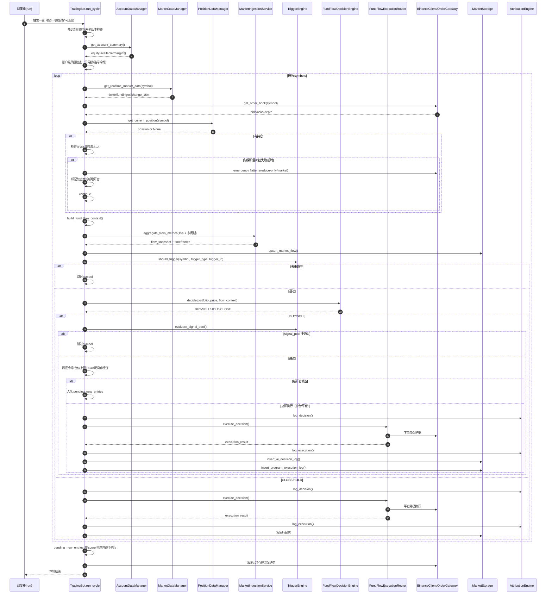
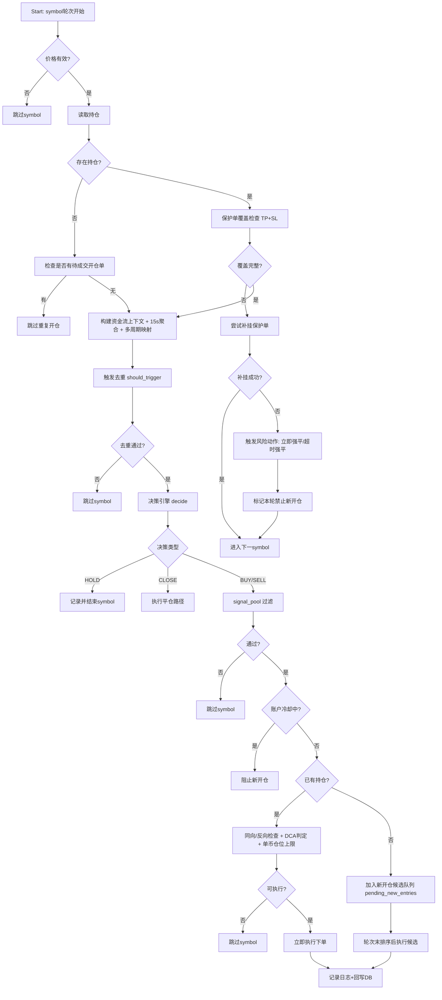
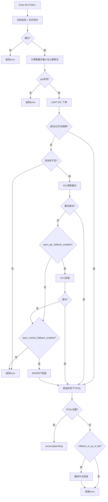
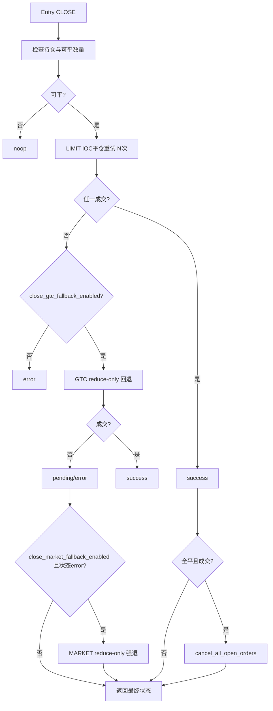
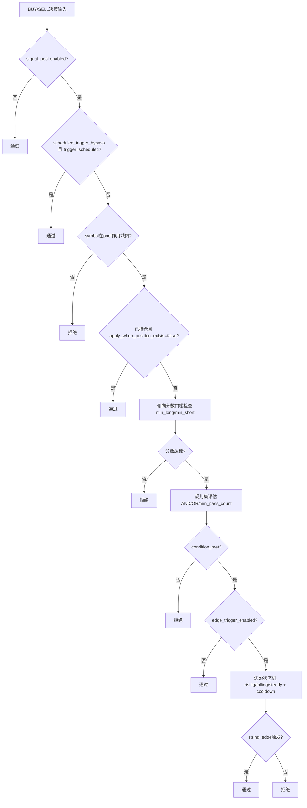

# FUND_FLOW 专家评审流程图版（Mermaid）

> 对应技术说明：`docs/fund_flow_strategy_technical_spec.md`

## 1. 端到端时序图（单轮 run_cycle）

## 2. 主决策树（交易对级）

## 3. 开仓执行降级树（Execution Router）

## 4. 平仓执行降级树（Execution Router）

## 5. 信号池规则判定树（规则层）

## 6. 会议讨论建议（配合图审）
1. 先看“主决策树”，确认策略行为边界（反向仓、加仓、候选排序）是否符合交易纪律。
2. 再看“开仓/平仓降级树”，确认执行安全优先级是否与团队预期一致。
3. 最后看“信号池判定树”，讨论阈值、规则逻辑和边沿触发是否导致错失/过度过滤。
