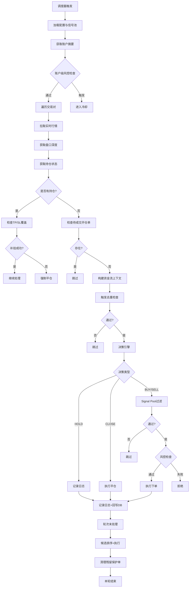
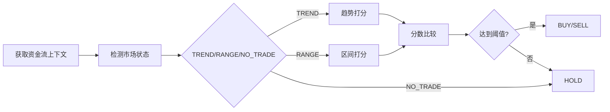
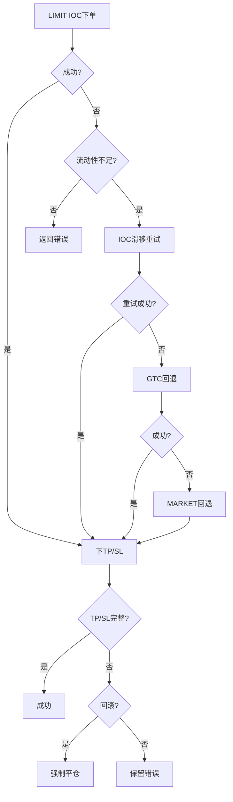
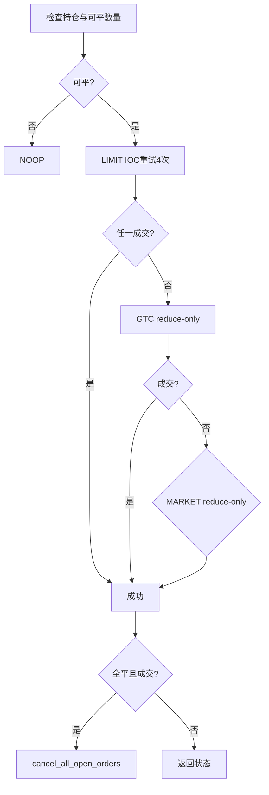
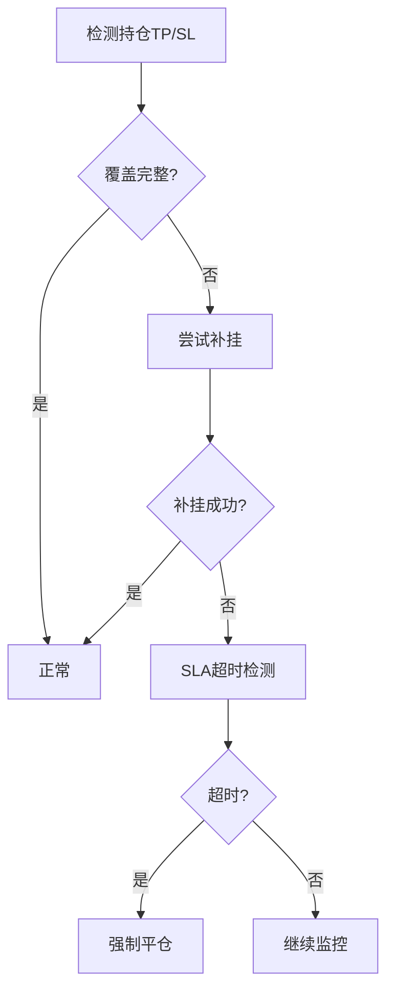

# 资金流量化交易策略完整技术文档

> 版本: v2.0 | 更新日期: 2026-02-25
> 用途: 供专家组评审与策略升级讨论

---

## 一、策略概述

### 1.1 核心理念

本策略基于**资金流(Fund Flow)**理论，通过聚合多维度市场数据构建短期价格动量预测模型，实现**趋势跟随**与**区间回归**双模式交易。策略采用双层门禁系统：

- **15分钟市场状态识别**：判断市场处于 TREND / RANGE / NO_TRADE 状态
- **5分钟执行打分**：根据资金流指标计算开仓/平仓分数

### 1.2 支持的交易对

| 类别 | 交易对 |
|------|--------|
| 主流币 | BTCUSDT, ETHUSDT, BNBUSDT, SOLUSDT |
| 主流币 | XRPUSDT, DOGEUSDT, ADAUSDT, TRXUSDT |
| 主流币 | AVAXUSDT, LINKUSDT, XLMUSDT |
| 山寨币 | TONUSDT, SUIUSDT, DOTUSDT, BCHUSDT |
| 山寨币 | LTCUSDT, UNIUSDT, HBARUSDT, APTUSDT |
| 山寨币 | NEARUSDT, SHIBUSDT, FOGOUSDT |

### 1.3 核心参数配置

```json
{
  "default_leverage": 2,
  "max_leverage": 2,
  "default_target_portion": 0.1,
  "max_active_symbols": 2,
  "decision_timeframe": "5m"
}
```

---

## 二、策略架构

### 2.1 模块结构

```
src/
├── main.py                          # 入口文件
├── app/
│   └── fund_flow_bot.py            # 主交易机器人
├── fund_flow/                       # 资金流核心模块
│   ├── market_ingestion.py         # 数据采集与聚合
│   ├── decision_engine.py          # 决策引擎
│   ├── trigger_engine.py           # 触发引擎
│   ├── execution_router.py         # 执行路由
│   ├── risk_engine.py              # 风控引擎
│   ├── market_storage.py           # 数据存储
│   └── attribution_engine.py       # 归因引擎
├── data/                           # 数据层
│   ├── market_data.py              # 市场数据
│   ├── account_data.py             # 账户数据
│   └── position_data.py            # 持仓数据
└── api/                            # 交易所接口
    ├── binance_client.py           # Binance客户端
    ├── market_gateway.py           # 市场网关
    └── order_gateway.py            # 订单网关
```

### 2.2 执行流程



---

## 三、数据采集与处理

### 3.1 数据源

| 数据类型 | 接口 | 频率 |
|----------|------|------|
| K线数据 | GET /fapi/v1/klines | 按需 |
| 24h行情 | GET /fapi/v1/ticker/24hr | 按需 |
| 资金费率 | GET /fapi/v1/fundingRate | 按需 |
| 持仓量 | GET /fapi/v1/openInterest | 按需 |
| 盘口深度 | GET /fapi/v1/depth | 按需 |
| 账户信息 | GET /papi/v1/account | 按需 |
| 持仓信息 | GET /papi/v1/um/positionRisk | 按需 |

### 3.2 采集降级策略

- **账户请求**: 3次指数退避重试 + 60秒TTL缓存
- **DB写入**: 失败时降级为 `None`（不中断交易）
- **日志写入**: 仅告警，不中断循环

### 3.3 15秒窗口聚合

```python
# 聚合规则
cvd_ratio:       窗口求和
cvd_momentum:    窗口末值 - 首值
oi_delta_ratio:  均值
depth_ratio:     均值
imbalance:       均值
funding_rate:    窗口末值
```

### 3.4 多周期聚合

支持时间框架: `1m, 3m, 5m, 15m, 30m, 1h, 2h, 4h`

每个周期独立计算:
- CVD (买卖货币差)
- CVD动量
- OI变化率
- 深度比率
- 订单不平衡度
- 流动性Delta归一化

---

## 四、资金流指标体系

### 4.1 核心七大因子

| 因子 | 计算公式 | 权重(趋势) | 权重(区间) |
|------|----------|------------|------------|
| CVD比率 | change_15m | 24% | - |
| CVD动量 | change_15m - change_24h/96 | 14% | 35% |
| OI变化率 | (OI_t - OI_{t-1}) / |OI_{t-1}| | 22% | 20% |
| 资金费率 | funding_rate | 10% | - |
| 深度比率 | bid_notional / ask_notional | 15% | 10% |
| 订单不平衡 | (bid - ask) / (bid + ask) | 15% | 55% |
| 流动性Delta | 归一化处理 | 12% | - |

### 4.2 分数计算公式

**趋势模式 (TREND)**:
```
long_score = 0.24*max(cvd,0) + 0.14*max(cvd_mom,0) + 0.22*max(oi_delta,0) 
           + 0.10*max(-funding,0) + 0.15*max(depth,0) + 0.15*max(imbalance,0)
           + 0.12*max(liquidity_delta_norm,0)

short_score = 0.24*max(-cvd,0) + 0.14*max(-cvd_mom,0) + 0.22*max(oi_delta,0)
            + 0.10*max(funding,0) + 0.15*max(-depth,0) + 0.15*max(-imbalance,0)
            + 0.12*max(-liquidity_delta_norm,0)
```

**区间模式 (RANGE)**:
```
long_score = 0.55*max(-imbalance,0) + 0.35*max(-cvd_mom,0) + 0.10*max(-depth,0)
short_score = 0.55*max(imbalance,0) + 0.35*max(cvd_mom,0) + 0.10*max(depth,0)
```

### 4.3 流动性归一化

```python
delta_notional = bid_notional - ask_notional
base_sample = |total_notional| 或 |delta_notional|
ema_t = alpha * base_sample + (1-alpha) * ema_{t-1}
norm = delta_notional / max(min_base, ema_t)
norm = clip(norm, -clip, +clip)
```

参数配置:
- `liquidity_norm_alpha = 0.2`
- `liquidity_norm_clip = 1.0`
- `liquidity_norm_min_base = 1000`

---

## 五、市场状态识别

### 5.1 15分钟周期判定

| 状态 | ADX条件 | ATR条件 | EMA条件 |
|------|---------|---------|---------|
| TREND | >= 21 | 0.0012 ~ 0.02 | EMA20 > EMA50 → LONG_ONLY<br>EMA20 < EMA50 → SHORT_ONLY |
| RANGE | <= 18 | 0.001 ~ 0.02 | 无要求 |
| NO_TRADE | 18 < ADX < 21 | 或 ATR超出范围 | 趋势状态但EMA走平 |

### 5.2 趋势方向锁定

```python
# 硬锁定: 完全跟随EMA方向
direction_lock_mode = "hard"

# 软锁定: ADX强度足够 + EMA开口明显
direction_lock_mode = "soft"
# 条件: ADX >= 21 + 4.0 且 EMA_gap >= 0.001

# 关闭: 不限制方向
direction_lock_mode = "off"
```

### 5.3 区间分位数系统

```python
# 区间模式专用分位数
range_quantile:
  timeframe: "5m"
  lookback_minutes: 120
  q_hi: 0.9      # 极端买方/卖方
  q_lo: 0.1
  
# 监控指标
metrics: ["imbalance", "cvd_momentum", "phantom_mean", "trap_last", "micro_delta_last"]
```

---

## 六、信号检测与触发

### 6.1 触发去重机制

```python
# 去重维度: symbol + trigger_type
# 去重窗口: trigger_dedupe_seconds (当前=30秒)
# 触发ID: trigger_id 重复直接拦截
```

### 6.2 Signal Pool 过滤

```python
# 分数门槛
min_long_score: 0.22    # 多头最低分数
min_short_score: 0.22   # 空头最低分数

# 边沿触发
edge_trigger_enabled: true
edge_cooldown_seconds: 300

# 规则逻辑
logic: "AND"           # AND/OR 模式
min_pass_count: 0      # 通过数量要求
```

### 6.3 信号定义

**趋势池 (trend_pool)**:
```json
{
  "signal_id": "trend_long_cvd",
  "side": "LONG",
  "metric": "cvd_momentum",
  "operator": ">=",
  "threshold": 0.0008,
  "timeframe": "5m"
},
{
  "signal_id": "trend_long_imb",
  "side": "LONG",
  "metric": "imbalance",
  "operator": ">=",
  "threshold": 0.1,
  "timeframe": "5m"
}
```

**区间池 (range_pool)**:
```json
{
  "signal_id": "range_long_extreme",
  "side": "LONG",
  "metric": "imbalance",
  "operator": "<=",
  "threshold": -0.14,
  "timeframe": "5m"
}
```

---

## 七、开仓逻辑

### 7.1 决策引擎流程



### 7.2 开仓条件

| 条件 | 多头 | 空头 |
|------|------|------|
| 分数要求 | long_score >= 0.22 | short_score >= 0.22 |
| 方向优势 | long_score > short_score | short_score > long_score |
| 市场状态 | 非NO_TRADE | 非NO_TRADE |
| Signal Pool | 通过过滤 | 通过过滤 |

### 7.3 仓位管理

| 参数 | 值 | 说明 |
|------|-----|------|
| default_target_portion | 0.1 | 10%账户余额 |
| add_position_portion | 0.05 | 加仓5% |
| max_symbol_position_portion | 0.18 | 单币种上限18% |
| max_active_symbols | 2 | 最大持仓币种数 |
| min_position_percent | 10 | 最小开仓比例 |
| reserve_percent | 20 | 预留资金比例 |

### 7.4 杠杆动态调整

```python
# 杠杆按信号强度映射
min_leverage = 2
max_leverage = 2  # 当前固定2倍

# 动态公式
strength = (score - threshold) / (1 - threshold)
leverage = min_leverage + strength * (max_leverage - min_leverage)
leverage = clamp(leverage, min_leverage, max_leverage)
```

### 7.5 DCA加仓机制

```python
dca_martingale_enabled: true
dca_max_additions: 1          # 最多加仓1次
dca_drawdown_thresholds: [0.01]  # 回撤1%触发
dca_multipliers: [1.0]        # 仓位倍数
```

### 7.6 执行降级链



执行参数:
```json
{
  "open_ioc_retry_times": 3,
  "open_ioc_retry_step_bps": 15,
  "open_gtc_fallback_enabled": true,
  "open_market_fallback_enabled": true
}
```

---

## 八、平仓逻辑

### 8.1 平仓触发条件

| 持仓类型 | 触发条件 |
|----------|----------|
| 多头持仓 | short_score >= 0.32 |
| 空头持仓 | long_score >= 0.32 |

### 8.2 平仓执行降级

```json
{
  "close_ioc_retry_times": 4,
  "close_ioc_retry_step_bps": 10,
  "close_gtc_fallback_enabled": true,
  "close_market_fallback_enabled": true
}
```

### 8.3 平仓流程



---

## 九、风控机制

### 9.1 账户级熔断

| 风险参数 | 值 | 说明 |
|----------|-----|------|
| max_daily_loss_percent | 5% | 日内最大亏损5% |
| max_consecutive_losses | 2 | 最大连亏次数 |
| daily_loss_cooldown_seconds | 28800 | 日亏损冷却8小时 |
| consecutive_loss_cooldown_seconds | 1800 | 连亏冷却30分钟 |

### 9.2 决策前风控

```python
# Symbol白名单校验
# 操作合法性校验  
# 杠杆范围: [min_leverage, max_leverage]
# 仓位比例: [min_open_portion, max_open_portion]
# 价格偏离: price_deviation_limit_percent (1%)
```

### 9.3 持仓保护单SLA

```json
{
  "protection_sla_enabled": true,
  "protection_sla_seconds": 90,
  "protection_sla_force_flatten": true,
  "protection_immediate_close_on_repair_fail": false,
  "protection_sla_alert_cooldown_seconds": 15
}
```

### 9.4 保护单检查流程



### 9.5 残留保护单清理

- 每轮尾部执行
- 无持仓且无待成交开仓单时撤销残留条件单

---

## 十、数据存储

### 10.1 数据库结构

**文件位置**: `logs/fund_flow/fund_flow_strategy.db`

| 表名 | 用途 | 主键 |
|------|------|------|
| crypto_klines | K线数据 | (exchange, symbol, period, timestamp) |
| market_trades_aggregated | 聚合成交 | (exchange, symbol, timestamp) |
| market_orderbook_snapshots | 盘口快照 | (exchange, symbol, timestamp) |
| market_asset_metrics | 资产指标 | (exchange, symbol, timestamp) |
| market_flow_timeframes | 多周期聚合 | (exchange, symbol, timeframe, timestamp) |
| ai_decision_logs | 决策日志 | id (自增) |
| program_execution_logs | 执行日志 | id (自增) |
| signal_definitions | 信号定义 | id |
| signal_pools | 信号池 | id |

### 10.2 日志文件

| 文件 | 路径 | 内容 |
|------|------|------|
| 归因日志 | logs/2026-02/XX/fund_flow_attribution.jsonl | 决策与执行详情 |
| 成交记录 | logs/2026-02/XX/trade_fills_utc.csv | 实际成交 |
| 亏损订单 | logs/2026-02/XX/loss_orders_*.json | 亏损订单明细 |
| 风控状态 | logs/2026-02/XX/fund_flow/fund_flow_risk_state.json | 风控状态 |

---

## 十一、当前参数快照

### 11.1 交易参数

```json
{
  "symbols": ["BTCUSDT", "ETHUSDT", ...共23个],
  "min_leverage": 2,
  "default_leverage": 2,
  "max_leverage": 2,
  "default_target_portion": 0.1,
  "max_active_symbols": 2
}
```

### 11.2 阈值参数

| 参数 | 趋势模式 | 区间模式 |
|------|----------|----------|
| long_open_threshold | 0.22 | 0.40 |
| short_open_threshold | 0.22 | 0.40 |
| close_threshold | 0.32 | 0.55 |
| max_symbol_position_portion | 0.18 | 0.10 |

### 11.3 风控参数

```json
{
  "account_circuit_enabled": true,
  "max_daily_loss_percent": 5,
  "max_consecutive_losses": 2,
  "stop_loss_default_percent": 1.2,
  "take_profit_default_percent": 0
}
```

### 11.4 调度参数

```json
{
  "interval_seconds": 60,
  "symbols_per_cycle": 22,
  "align_to_kline_close": true,
  "kline_close_delay_seconds": 3,
  "max_cycle_runtime_seconds": 45
}
```

---

## 十二、亏损分析与改进建议

### 12.1 2026年2月日志分析

从 `fund_flow_attribution.jsonl` 分析发现:

| 指标 | 数值 |
|------|------|
| 总开仓次数 | 56次 |
| 资金流分数<0.15的占比 | 21.4% (12/56) |
| 外部平仓占比 | 约60% |
| 多空方向 | 大量做空交易 |

### 12.2 问题识别

1. **门禁模式**: 当前为 `assist` 模式，低分交易未被强制拦截
2. **方向问题**: 2026年2月BTC处于牛市上行，大量做空导致亏损
3. **阈值偏低**: 0.15的开仓阈值过于宽松

### 12.3 已实施改进

```json
{
  "flow_signal_hard_gate": true,
  "flow_candidate_hard_gate": true,
  "flow_min_score_short": 0.20,
  "flow_min_hits_short": 2
}
```

---

## 十三、待专家评审议题

### 13.1 数据质量

1. **CVD代理问题**: 当前用价格变化近似CVD，是否需要替换为逐笔成交驱动的真实CVD?
2. **signal_strength定义**: 当前 `>0` 即为signal触发，弱化了scheduled分支意义

### 13.2 参数优化

1. **平仓阈值**: `close_threshold=0.32` 与开仓阈值接近，敏感性是否过高?
2. **区间阈值**: 趋势/区间阈值差异是否合理?
3. **DCA参数**: 倍数与单币上限的尾部风险评估

### 13.3 执行层面

1. **保护单策略**: 补挂与强平在极端行情下的滑点评估
2. **执行降级**: GTC/MARKET回退的成交确定性
3. **流动性**: 山寨币流动性不足时的处理策略

### 13.4 策略方向

1. **趋势方向锁定**: 当前硬锁定模式是否适合当前市场?
2. **多周期协同**: 15m/5m/1m周期的信号权重优化
3. **分位数系统**: 区间模式下的极端值判定逻辑优化

---

## 附录: 文件索引

| 文件 | 说明 |
|------|------|
| src/main.py | 入口文件 |
| src/app/fund_flow_bot.py | 主交易机器人 |
| src/fund_flow/decision_engine.py | 决策引擎 |
| src/fund_flow/trigger_engine.py | 触发引擎 |
| src/fund_flow/execution_router.py | 执行路由 |
| src/fund_flow/risk_engine.py | 风控引擎 |
| src/fund_flow/market_ingestion.py | 数据采集 |
| src/fund_flow/market_storage.py | 数据存储 |
| config/trading_config_fund_flow.json | 策略配置 |
| docs/fund_flow_strategy_technical_spec.md | 技术说明 |
| fund_flow_strategy_expert_diagrams.md | 流程图 |
