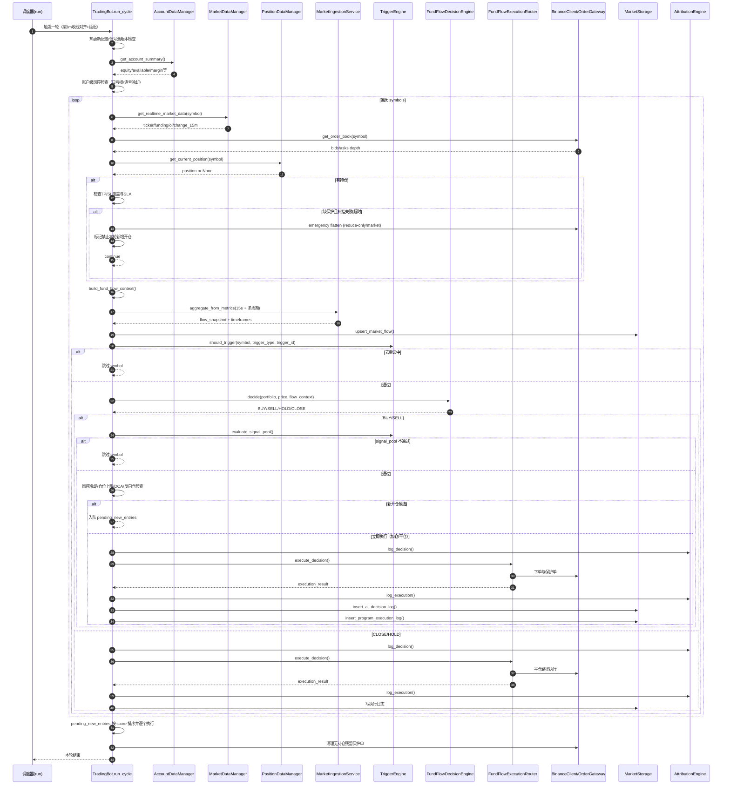
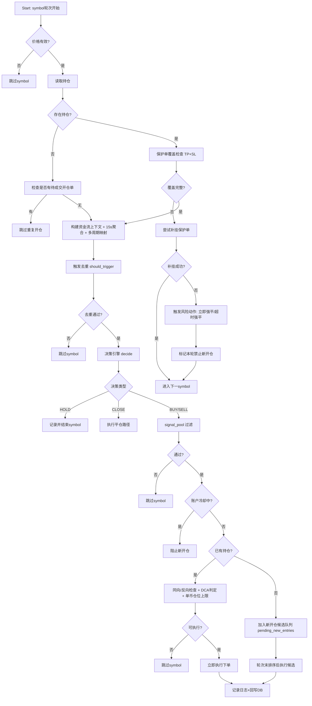
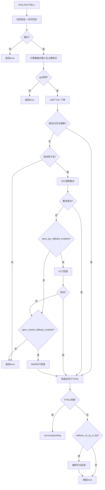
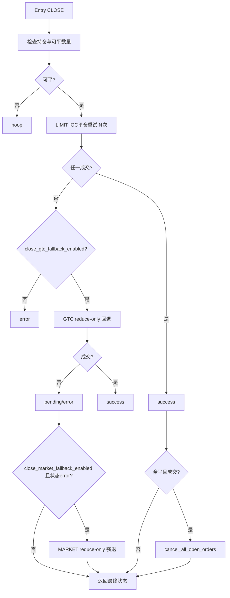
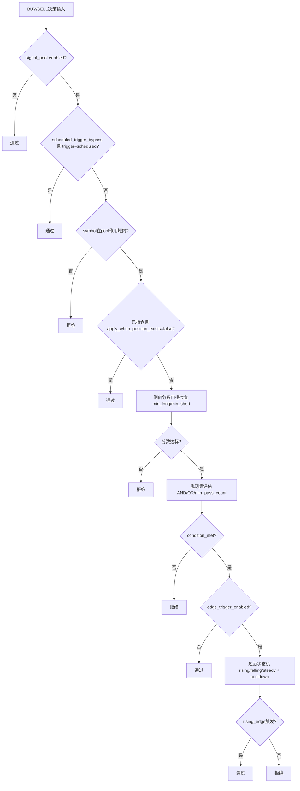
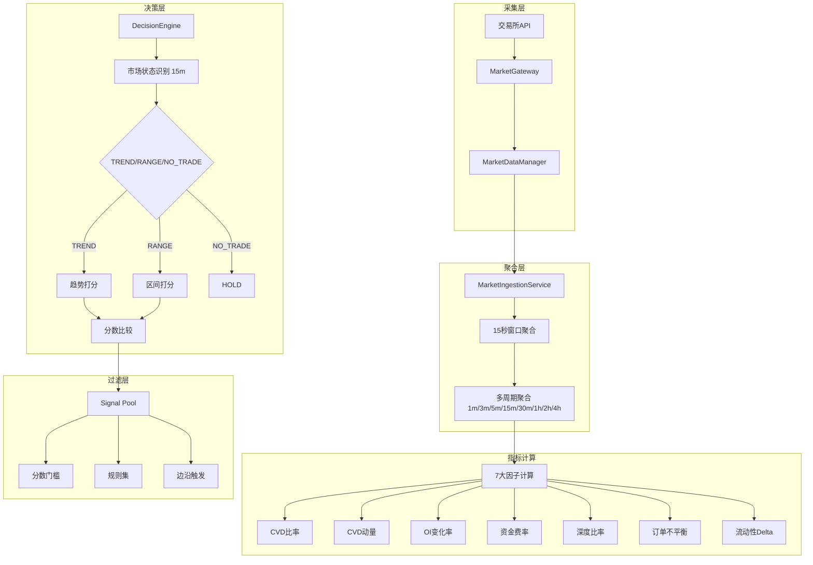
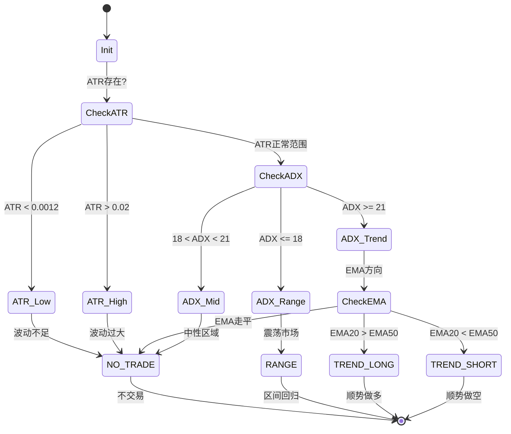
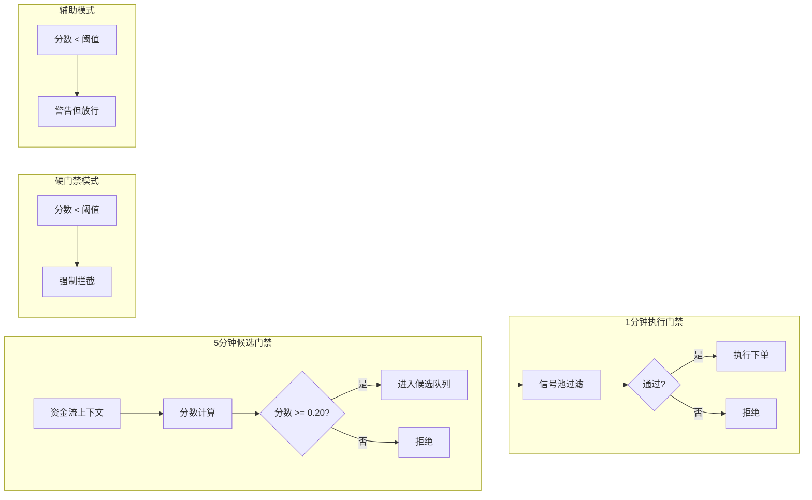
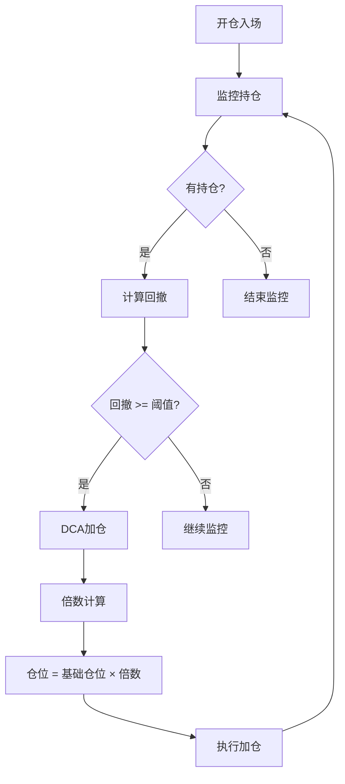
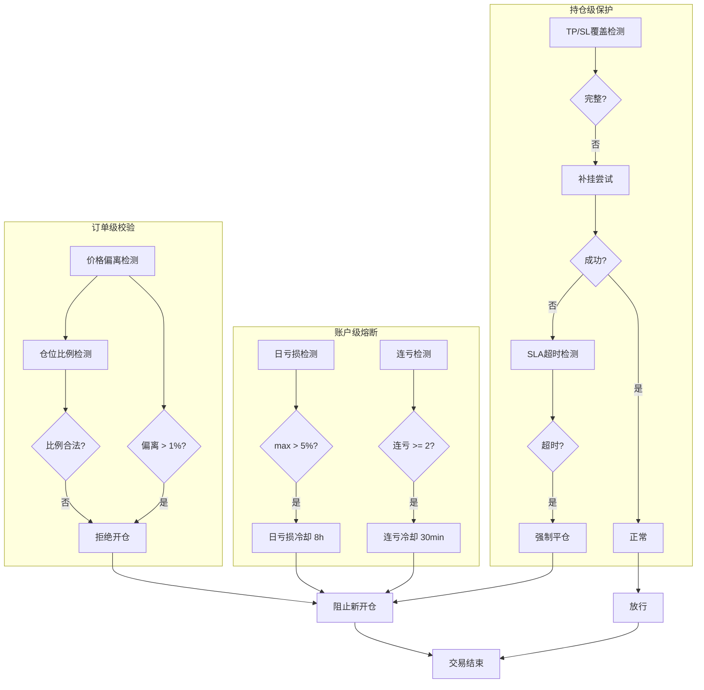

# FUND_FLOW 专家评审流程图版（Mermaid）

> 对应技术说明：`docs/fund_flow_strategy_technical_spec.md`

## 1. 端到端时序图（单轮 run_cycle）



## 2. 主决策树（交易对级）



## 3. 开仓执行降级树（Execution Router）



## 4. 平仓执行降级树（Execution Router）



## 5. 信号池规则判定树（规则层）



## 6. 会议讨论建议（配合图审）
1. 先看"主决策树"，确认策略行为边界（反向仓、加仓、候选排序）是否符合交易纪律。
2. 再看"开仓/平仓降级树"，确认执行安全优先级是否与团队预期一致。
3. 最后看"信号池判定树"，讨论阈值、规则逻辑和边沿触发是否导致错失/过度过滤。

---

## 7. 资金流指标计算架构



### 7.1 7-Factor权重分配

| 因子 | 趋势权重 | 区间权重 | 计算来源 |
|------|----------|----------|----------|
| CVD比率 | 24% | - | change_15m |
| CVD动量 | 14% | 35% | change_15m - change_24h/96 |
| OI变化率 | 22% | 20% | (OI_t - OI_{t-1}) / |OI_{t-1}| |
| 资金费率 | 10% | - | funding_rate |
| 深度比率 | 15% | 10% | bid_notional / ask_notional |
| 订单不平衡 | 15% | 55% | (bid - ask) / (bid + ask) |
| 流动性Delta | 12% | - | 归一化处理 |

---

## 8. 市场状态识别 (15分钟周期)



### 8.1 状态参数

| 状态 | ADX阈值 | ATR范围 | EMA要求 |
|------|---------|---------|---------|
| TREND | >= 21 | 0.12%~2% | 方向明确 |
| RANGE | <= 18 | 0.1%~2% | 无要求 |
| NO_TRADE | 18~21 | 超出范围 | EMA走平 |

---

## 9. 双层门禁系统



### 9.1 门禁配置

```json
{
  "flow_signal_hard_gate": true,
  "flow_candidate_hard_gate": true,
  "flow_min_score_short": 0.20,
  "flow_min_hits_short": 2
}
```

---

## 10. DCA加仓机制



### 10.1 DCA参数

```json
{
  "dca_martingale_enabled": true,
  "dca_max_additions": 1,
  "dca_drawdown_thresholds": [0.01],
  "dca_multipliers": [1.0]
}
```

---

## 11. 风控防护体系



---

## 12. 专家评审核心议题

### 12.1 数据质量优化

1. **CVD代理问题**
   - 当前用 `change_15m` 近似CVD
   - 建议: 接入逐笔成交数据计算真实CVD
   - 影响: 提高短期动量预测准确性

2. **signal_strength定义**
   - 当前 `>0` 即为signal触发
   - 问题: scheduled分支几乎不生效
   - 建议: 重新定义触发判据

### 12.2 参数优化空间

| 参数 | 当前值 | 建议讨论范围 | 说明 |
|------|--------|--------------|------|
| close_threshold | 0.32 | 0.35~0.45 | 平仓敏感性 |
| long_open_threshold | 0.22 | 0.25~0.30 | 开仓严格度 |
| short_open_threshold | 0.22 | 0.25~0.30 | 空头过滤 |
| range_threshold | 0.40 | 0.35~0.50 | 区间模式 |

### 12.3 执行安全

1. **保护单SLA**: 90秒超时是否足够?
2. **GTC回退**: 流动性不足时的成交确定性
3. **极端行情**: 强平策略的滑点控制

### 12.4 策略方向

1. **趋势锁定**: 硬锁定 vs 软锁定 vs 关闭
2. **分位数优化**: 区间模式极端值判定
3. **多周期协同**: 15m/5m/1m信号权重

---

## 13. 改进路线图

### Phase 1: 近期改进 (1-2周)
- [ ] 验证硬门禁效果
- [ ] 分析亏损订单特征
- [ ] 调整平仓阈值

### Phase 2: 中期优化 (1个月)
- [ ] 真实CVD数据接入
- [ ] 分位数系统优化
- [ ] 边沿触发逻辑改进

### Phase 3: 长期演进 (季度)
- [ ] 机器学习因子权重
- [ ] 自适应阈值系统
- [ ] 多市场状态并行

---

## 14. 附录: 关键代码路径

```
src/fund_flow/
├── decision_engine.py    # _score_trend(), _score_range(), _detect_regime()
├── trigger_engine.py     # should_trigger(), evaluate_signal_pool()
├── execution_router.py   # execute_open(), execute_close()
├── risk_engine.py        # validate_operation()
├── market_ingestion.py   # aggregate_from_metrics()
└── attribution_engine.py # log_decision(), log_execution()
```

```
config/
├── trading_config_fund_flow.json   # 资金流策略配置
└── trading_config_vps.json        # VPS运行配置
```
